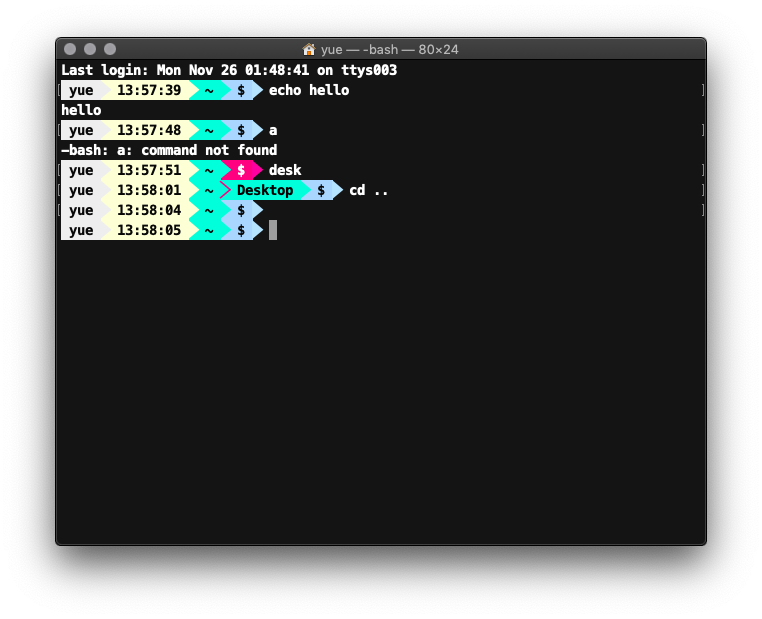
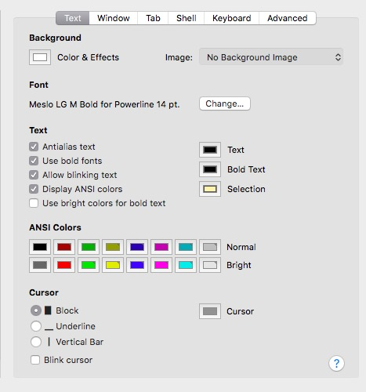

# yue-powerline-theme
theme for powerline-shell

font: Meslo LG M Bold for Powerline 
link: [github](https://github.com/powerline/fonts)

### Screenshot:

### Settings:

---

### Setup:

#### 1. Install

Follow the instructions on [powerline-shell](https://github.com/b-ryan/powerline-shell) to install and config customization files

#### 2. Setup 

1. on Mac:  
clone this repo and  run  `sh setup.sh`

2. on other platforms:
 
  put `config.json` and `yue.py` to your config and theme folders
